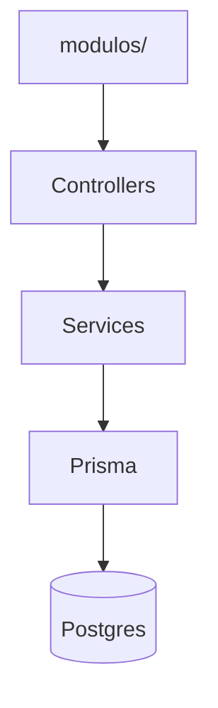
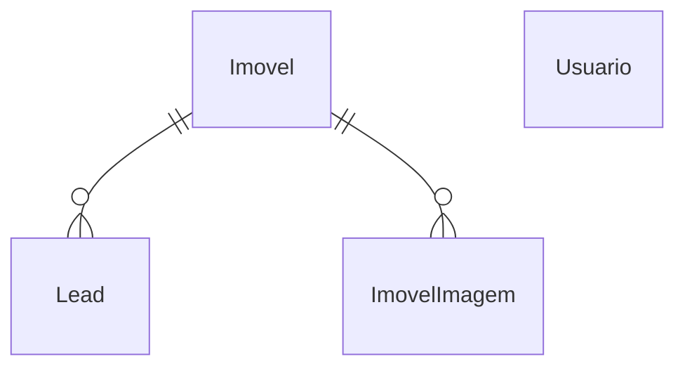

# SI - Backend

API REST do CRM. NestJS, Prisma e PostgreSQL.

**Repositório:** [github.com/guilhermemarch/si_backend](https://github.com/guilhermemarch/si_backend)

## Repositórios relacionados

| Serviço | Repositório |
|---------|-------------|
| Frontend | [github.com/guilhermemarch/si_frontend](https://github.com/guilhermemarch/si_frontend) |
| Backend | [github.com/guilhermemarch/si_backend](https://github.com/guilhermemarch/si_backend) |
| IA | [github.com/guilhermemarch/si_ia](https://github.com/guilhermemarch/si_ia) |

## Fluxo



## Módulos

| Módulo | Responsabilidade |
|--------|------------------|
| `autenticacao` | Login, cadastro, JWT |
| `imoveis` | CRUD de imóveis + galeria |
| `leads` | CRUD de leads + status |
| `dashboard` | Resumo agregado |
| `chatbot` | Proxy para o serviço de IA |
| `assets` | Upload e proxy S3 |

## Banco de dados



## Rotas principais

| Grupo | Endpoints |
|-------|-----------|
| Auth | `POST /auth/login`, `POST /auth/cadastro`, `GET /auth/me` |
| Imóveis | `GET/POST /imoveis`, `GET/PATCH/DELETE /imoveis/:id` |
| Leads | `GET/POST /leads`, `GET/DELETE /leads/:id`, `PATCH /leads/:id`, `PATCH /leads/:id/status` |
| Dashboard | `GET /dashboard/resumo` |
| Chatbot | `POST /chatbot/conversa` |
| Assets | `GET /assets/imoveis/images/:arquivo`, `POST /assets/imoveis/upload` |

Collection Postman: `postman/collection.json`

## Configuração

```bash
cp .env.example .env
```

```env
DATABASE_URL=postgresql://...
JWT_SECRET=segredo-local
JWT_EXPIRES_IN=1d
IA_SERVICE_URL=http://localhost:8000
PORT=3001
S3_ENDPOINT=...
S3_BUCKET=...
S3_REGION=auto
S3_ACCESS_KEY_ID=...
S3_SECRET_ACCESS_KEY=...
S3_PUBLIC_URL_BASE=...
IMOVEIS_ASSETS_BASE_URL=http://localhost:3001/assets
```


API em http://localhost:3001

O Docker **não** executa seed nem migrate. O banco já deve estar populado.

## Permissões (RBAC)

| Perfil | Leitura (GET) | Escrita (POST/PATCH/DELETE) | Chatbot |
|--------|---------------|-----------------------------|---------|
| `ADMIN` | Sim | Sim | Sim |
| `USUARIO` | Sim | Não (403) | Sim |

`JwtGuard` autentica; `RolesGuard` + `@Roles(ADMIN)` protegem rotas de escrita em imóveis, leads e upload de imagens.

### Seed manual (opcional, só dev)

```bash
npm run seed
```

Use apenas para resetar um banco vazio em desenvolvimento local.

O manifest de imóveis deve usar `imagensUrls`; a primeira URL vira a capa (`ordem = 0`) na galeria.

### Logins demo

| Perfil | Email | Senha |
|--------|-------|-------|
| Admin (CRUD) | `admin@solucoesimobiliarias.com` | `admin123` |
| Visualizador (só leitura) | `viewer@solucoesimobiliarias.com` | `viewer123` |

## Docker

```bash
docker build -t si-backend .
docker run --env-file .env -p 3001:3001 si-backend
```
